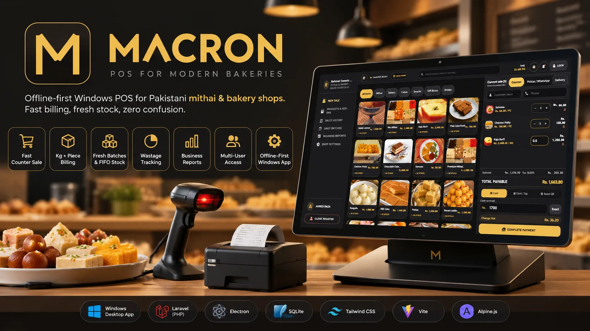
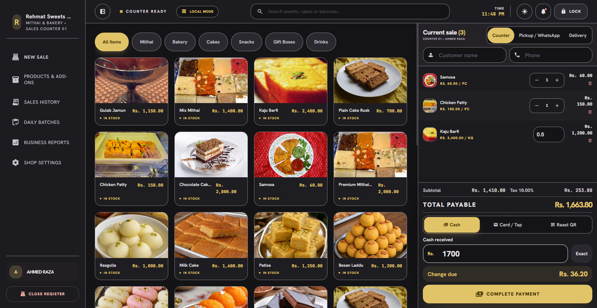
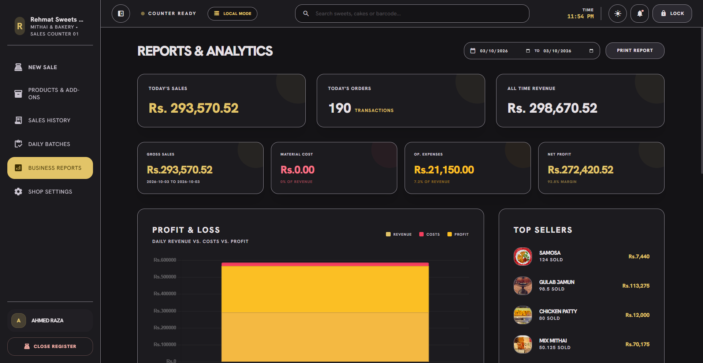
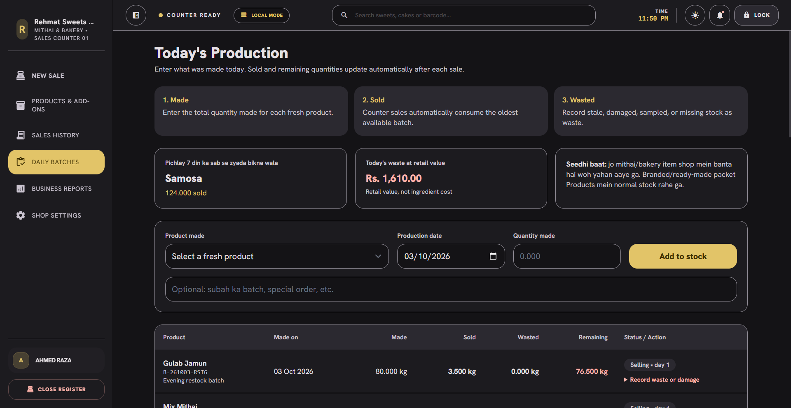
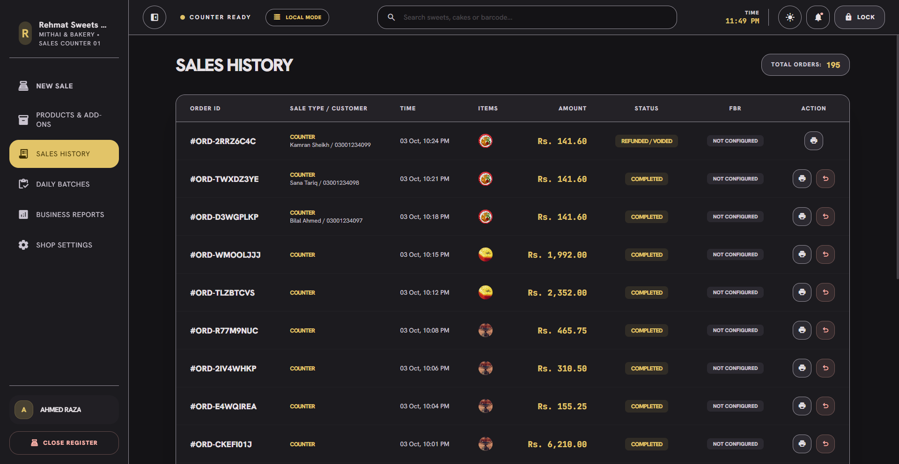

# Macaron

<p>
  
  
  
  
  
  
  
  <a href="https://github.com/MAhsaanUllah/Macaron-POS/actions/workflows/ci.yml"></a>
  <a href="https://github.com/MAhsaanUllah/Macaron-POS/releases/latest"></a>
  
</p>



<p align="center"><sub>The counter on screen is the actual app. The scanner and receipt printer in the art are
illustrative — physical hardware is listed under Honest limitations, not claimed.</sub></p>

Offline-first counter POS for Pakistani mithai and bakery shops, shipped as a
per-user Windows desktop app. An Electron shell bundles a portable PHP runtime and
serves this Laravel codebase on `127.0.0.1` only — no server, no internet, no
per-shop cloud account. Everything lives in one local SQLite file.

**Promise:** har gram, har sale, hisaab clear.

> **Why this is public as a side project, not a product.** I built this to solve a
> real workflow I keep seeing at local sweet counters, and to prove an
> Electron-delivered PHP app end to end. Commercially, a Pakistani shop can already
> buy a POS machine + drawer + scanner + software bundle for around Rs 25,000, so a
> solo-built desktop app is not a business I can win here. This repo stays open as
> portfolio work: the architecture, the money-correctness tests, and the release
> discipline are the point. Feature PRs are welcome; sales enquiries are not.

## Interface

| | |
|---|---|
| **Counter** — weight-or-piece billing, category chips, live cart, cash / card / Raast tender and change, all offline. |  |
| **Business reports** — date-ranged P&L, revenue vs cost vs profit chart, top sellers by rupee value. |  |
| **Daily batches** — what was made this morning, FIFO consumption by the counter, day-old flags and wastage at retail value. |  |
| **Sales history** — every order with sale type, customer, amount, status and reprint/void actions. |  |

Screenshots are from the packaged app running a demo shop on a 1920px window. UI
copy mixes English and Roman Urdu on purpose — that is how these counters actually
talk.

## Features

**Counter billing**
- Weight (`kg`/gram) and per-piece products in the same cart; server-side rounding
  to the paisa, so the till and the receipt can never disagree.
- Cash, card and Raast tender paths with tendered/change computed by the server.
- Walk-in customer name + phone, role-gated discount ceiling, barcode search.
- Offline is the default state, not a fallback mode.

**Fresh stock**
- Daily production batches with FIFO allocation from the counter; oldest batch sells first.
- Day-old "Selling • day 1" status, nearest-expiry surfacing, and wastage recorded at retail value.
- Made-here items are batch-tracked; ready-made packets use plain stock.

**Cash control**
- Shift open with float, close with a Z-Report: expected vs counted cash and a variance line.
- Cancellations/refunds produce a VOID receipt state and return stock to the right batch.
- Audit log of who did what on money paths.

**Delivery & packaging**
- Electron shell: first-run migrate, auto-backup, per-user NSIS installer (no admin/UAC).
- Optional LAN mode so a second counter or a phone can reach the same till.
- Thermal receipt HTML printed through the shell, plus a printable FBR block that
  only appears when a real FBR integration is configured (never fabricated).

**Roles** — owner/admin, cashier, manager, production; permission checks are server-side.

## Tech stack

| Layer | Choice | Why |
|---|---|---|
| Desktop shell | Electron 44 + Node test runner | One `.exe` a shopkeeper can install without an admin password |
| Runtime | Portable PHP 8.4 bundled in the installer | No XAMPP/Herd/VC-redist on the shop PC |
| Backend | Laravel 11, Blade | Server owns prices, totals, tax, stock, FIFO, permissions |
| Database | SQLite, single file | Back up = copy one file; `integrity_check` is a real gate |
| Frontend | Alpine.js 3 + Tailwind 3 via Vite | Interactivity without a SPA build or a CDN |
| Packaging | electron-builder (NSIS, per-user) | ~163 MB self-contained installer |
| Testing | PHPUnit + `node --test` | 41 PHP feature tests (214 assertions) + 19 shell tests (2 need real hardware, so they skip) |

~9,800 lines of first-party source across 110 files.

## Try it

**Installer.** [Download **Macaron Setup 1.1.0.exe**](https://github.com/MAhsaanUllah/Macaron-POS/releases/download/v1.1.0/Macaron.Setup.1.1.0.exe)
from the Releases page (~163 MB, per-user, no admin rights needed), or build it with the
commands below. First run is a short setup wizard: shop name, tax rate, staff accounts, then
the counter opens. The binary is unsigned, so SmartScreen shows a warning — "More info → Run".
SHA-256 `fce3a431b2e0cfb3d14722c3d52a8b81c0f90c9c72d6056711aaa55eef0bcce4`.

**See it populated instead of empty.** `DemoCounterSeeder` is an opt-in persona —
Rehmat Sweets & Bakers, 32 products (25 with photos), staff, fresh FIFO batches and
a short sales history. It never runs on a real install, so it cannot touch a
merchant's data. Seed the dev shell's own data directory, then launch it:

```powershell
New-Item -ItemType Directory desktop\dev-data\storage -Force
New-Item desktop\dev-data\database.sqlite -Force
$env:DB_DATABASE      = "$PWD\desktop\dev-data\database.sqlite"
$env:APP_STORAGE_PATH = "$PWD\desktop\dev-data\storage"
php artisan migrate --seed --force
php artisan db:seed --class=DemoCounterSeeder --force
npm run desktop:dev
```

Sign in as `owner@rehmatsweets.pk` / `macaron123` (also `cashier@…`, `manager@…`).
The screenshots show a heavier dataset than this seeder ships with — the same
persona after the 100-sale stress run — kept out of git on purpose, because a live
database copy comes with the install's `secret.key`.

**From source.**

```powershell
npm install
composer install
npm run desktop:dev      # Electron shell + bundled PHP against desktop/dev-data/
npm run desktop:test     # 19 shell tests
npm run desktop:build    # dist-desktop/Macaron Setup <version>.exe
```

`desktop:build` fetches the portable PHP runtime, stages `resources/app`, then runs
electron-builder. Plain `php artisan serve` is a backend workshop with **different data** —
never verify product behavior there.

## Quality gates

```powershell
npm install
npm run build           # once per clone: Blade views need the Vite manifest
vendor\bin\pint --dirty
php artisan view:cache
php artisan test
npm run desktop:test
git diff --check
```

CI runs the same gates on every push and pull request
([`.github/workflows/ci.yml`](.github/workflows/ci.yml)).

Release evidence: a 100-sale stress run through real HTTP routes with fractional
weights (0.125 → 5 kg) finished 100/100 with zero duplicates, zero money
mismatches and zero console errors, and FIFO batch allocation reconciled exactly
against units sold. SQLite `integrity_check` ok with zero foreign-key violations
on a 195-order database, and cashier role-abuse attempts are blocked server-side.

## Honest limitations

- Physical receipt printer, cash drawer, barcode scanner hardware, and a phone on
  LAN were **not available** on my test machine. The software paths behind them are
  tested; the hardware paths are marked UNVERIFIED, not claimed.
- FBR e-invoicing is implemented but **not certified** — no merchant sandbox pass.
- Reports' material-cost line depends on a recipe/ingredient model that has no UI
  yet, so P&L shows revenue and expenses with zero material cost. Known gap.
- Multi-branch, full accounting/CRM and a native Android app are deliberate non-goals.

## Repo map

```
desktop/            Electron shell: main.cjs, preload, router, own tests (dev-data/ is
                    created on first run and stays out of git)
app/                Laravel controllers, models, services (server owns the maths)
resources/views/    Blade UI — counter, production, orders, reports, settings
resources/js|css/   Alpine components and the Tailwind build (Vite)
routes/web.php      All routes; role middleware guards money + admin surfaces
database/           Migrations, SweetShopSeeder (auto) + DemoCounterSeeder (opt-in)
tests/              PHPUnit feature tests   |   desktop/test/  shell tests
scripts/            Portable PHP runtime fetch, desktop staging prep, icon generator
docs/screenshots/   The four images above   |   docs/brand/  icon + banner source
```

## Working on this repo

These are the rules I held myself to; they are the review bar for any PR too.

**Product boundary.** Pakistani single-outlet mithai/bakery counter, owner +
cashier as the primary roles. Rush-hour billing speed, weight accuracy, daily cash
control and wastage visibility come first. It is not a restaurant, retail,
accounting, CRM or multi-branch ERP, and it will not become one.

**Engineering.**
- Smallest working change. Reuse Laravel, Blade, Alpine, SQLite and native
  Electron/Chromium features before writing anything; no new dependency without a
  test that proves the need.
- The server owns prices, totals, tax, stock, FIFO, permissions and cancellation
  rules. The browser never decides a money number.
- Sales and audit history are append-only in practice: back up the SQLite file
  before any migration or data change, and never rewrite a completed order.
- One coherent commit per completed outcome — no formatting-only or drive-by
  cleanup mixed in. Before committing: `pint --dirty`, `php artisan view:cache`,
  both test suites, `git diff --check`.
- Fix the root cause, then leave one runnable check that fails without the fix.

**UI.**
- Material 3 light/dark tokens are the only colour source: CSS custom properties in
  `resources/css/app.css`, surfaced through `tailwind.config.js`. No page-specific
  hex values.
- Counter surfaces need readable labels and 48px touch targets over decorative
  density; touch, mouse and keyboard must reach the same sale actions.
- Never a stock-food photo for a real product. Until a merchant photo exists, the
  item shows its initial.
- UI copy mixes English and Roman Urdu where a counter actually speaks Urdu.

**Verification.** Product behavior gets checked inside the Electron shell with its
own data (`desktop/dev-data/` in dev, `%APPDATA%\macaron` when installed) — a plain
`php artisan serve` workshop has different data and is never a proof of anything.
Hardware and FBR claims stay marked UNVERIFIED until a real device or merchant
sandbox passes; a screenshot of a browser tab is not evidence.

## License

MIT — see [LICENSE](LICENSE).
